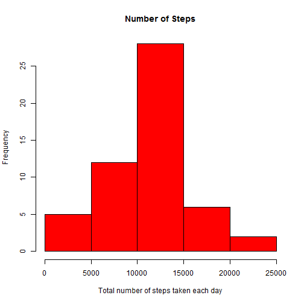
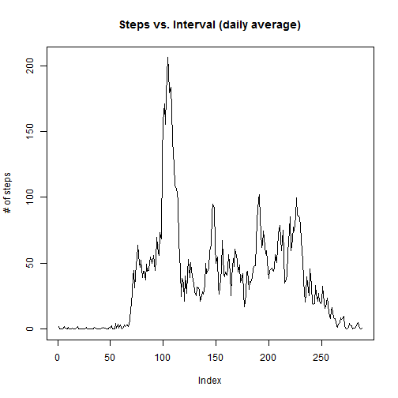

# Reproducible Research: Peer Assessment 1


## Loading and preprocessing the data

```r
activity <- read.csv("activity.csv", header=TRUE)
activity_clean <- activity[which(activity$steps != "NA"),]
```
## What is mean total number of steps taken per day?

```r
library(plyr)
stepsperday <- ddply(activity_clean, .(date), summarise, steps=sum(steps))
hist(stepsperday$steps, main="Number of Steps",xlab="Total number of steps taken each day", col="red")
```

 

```r
mean(stepsperday$steps)
```

```
## [1] 10766
```

```r
median(stepsperday$steps)
```

```
## [1] 10765
```
## What is the average daily activity pattern?

```r
avgdailypattern <- tapply(activity$steps, activity$interval, mean, na.rm = T)
plot(avgdailypattern, type = "l", main = ("Steps vs. Interval (daily average)"), ylab = "# of steps")
```

 

```r
seq(along = avgdailypattern)[avgdailypattern == max(avgdailypattern)]
```

```
## [1] 104
```
## Imputing missing values

Calculate and report the total number of missing values in the dataset

```r
sum(as.numeric(is.na(activity$steps)))
```
There are 2,304 missing values.

```
## [1] 2304
```
Devise a strategy for filling in all of the missing values in the dataset. The strategy does not need to be sophisticated. For example, you could use the mean/median for that day, or the mean for that 5-minute interval, etc.
Create a new dataset that is equal to the original dataset but with the missing data filled in.
Make a histogram of the total number of steps taken each day

The mean of the the intervals was used as a proxy for the missing data.

```r
avgdailypatternvector <- as.vector(avgdailypattern)
avgdailypatternvector <- rep(avgdailypatternvector, 61)
avgdailypatternvector[!is.na(activity$steps)] = 1
missingdatavector <- as.vector(activity$steps)
missingdatavector[is.na(missingdatavector)] = 1
avgforna_activity <- activity
avgforna_activity$steps <- avgdailypatternvector * missingdatavector

complete_stepsperday <- ddply(avgforna_activity, .(date), summarise, steps=sum(steps))

hist(complete_stepsperday$steps, main="Number of Steps", xlab="Total number of steps taken each day", col="red",)
```

 
The added mean values have increased the amount of steps in the middle of the histogram.


```r
mean(complete_stepsperday$steps)
```

```
## [1] 10766
```

```r
median(complete_stepsperday$steps)
```

```
## [1] 10766
```
Calculate and report the mean and median total number of steps taken per day. Do these values differ from the estimates from the first part of the assignment? What is the impact of imputing missing data on the estimates of the total daily number of steps?

And the median now is equal to the mean because the imputed missing data lies in the center of the dataset.

## Are there differences in activity patterns between weekdays and weekends?

```r
library(lattice)
weekdays <- weekdays(as.Date(activity_clean$date))
data_with_weekdays <- transform(activity_clean, day=weekdays)
data_with_weekdays$wk <- ifelse(data_with_weekdays$day %in% c("Saturday", "Sunday"),"weekend", "weekday")
average_by_interval_wk <- ddply(data_with_weekdays, .(interval, wk), summarise, steps=mean(steps))

xyplot(steps ~ interval | wk, data = average_by_interval_wk, layout = c(1, 2), type="l", xlab = "Interval", ylab = "Number of steps")
```

 
